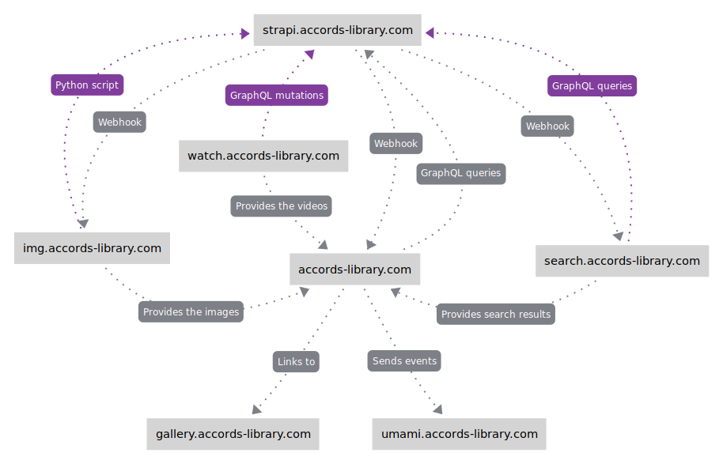

# Accords-library.com

[](https://github.com/Accords-Library/accords-library.com/actions/workflows/node.js.yml)
[](https://github.com/Accords-Library/accords-library.com/blob/main/LICENSE)


## Introduction

Accord’s Library is a fan-site that aims at gathering and archiving all of Yoko Taro’s work.
Yoko Taro is a Japanese video game director and scenario writer. He is best-known for his work on the NieR and Drakengard (Drag-on Dragoon) franchises.

## Technologies

### Overview



_Purple connections are actions done at build-time only. Grey connections can be at build-time or run-time._

### [strapi.accords-library.com](https://github.com/Accords-Library/strapi.accords-library.com)

Our Content Management System (CMS) that uses [Strapi](https://strapi.io/).

- Use the official [GraphQL plugin](https://market.strapi.io/plugins/@strapi-plugin-graphql)
- Multilanguage support
- Markdown format for the rich text fields
- Use webhooks to notify the front-end, search engine, and image processor when new content/media has been created/modified/deleted

### [img.accords-library.com](https://github.com/Accords-Library/img.accords-library.com)

A custom made image processor to overcome the lack of customization offered by Strapi build-in image processor. There is a python script to bulk process all images uploaded to Strapi. Subsequent changes to Strapi's media library can be handled using webhooks. The repo includes a server that listen to these webhook calls, and another to serve the images.

Each image in Strapi's media library is converted to four different formats:

- Small: 512x512, quality 60, .webp
- Medium: 1024x1024, quality 75, .webp
- Large: 2048x2048, quality 80, .webp
- Og: 512x512, quality 60, .jpg

### [search.accords-library.com](https://github.com/Accords-Library/search.accords-library.com)

A search engine that uses [Meilisearch](https://www.meilisearch.com/).
The repo includes a docker-compose file to run an instance of Meilisearch. There is also a server that populates Meilisearch's documents at startup, then listen to webhooks sent by Strapi for subsequent changes.

### [gallery.accords-library.com](https://github.com/Accords-Library/gallery.accords-library.com)

An image board engine, uses [Szurubooru](https://github.com/rr-/szurubooru), a lighweight engine inspired by Danbooru (and Booru-type galleries in general). Unlike the other subdomains, this repo is completely separated from the rest of the stack.

### [watch.accords-library.com](https://github.com/Accords-Library/watch.accords-library.com)

A set of tools to archive videos on multiple platforms. The repo contains a CLI tool to archive YouTube videos. There is also a Python script which import the videos metadata to Strapi using GraphQL mutations. Finally, there's a server to serve the video files and thumbnail.

### [umami.accords-library.com](https://umami.is/)

An open-source self-hosted alternative to Google Analytics which doesn't require a cookie notice to be GDPR compliant.

### [accords-library.com](https://github.com/Accords-Library/accords-library.com) (this repository)

A detailled look at the technologies used in this repository:

- Language: [TypeScript](https://www.typescriptlang.org/)

- Framework: [Next.js 13](https://nextjs.org/) (React 18)

- SSG + ISR (Static Site Generation + Incremental Static Regeneration)

  - The website is built before running in production
  - Performances are great, and it's possible to deploy the app on a CDN
  - On-Demand ISR to continuously update the website when new content is added or existing content is modified/deleted
  - Some widely used data (e.g: UI localizations) are downloaded separetely into `public/local-data` as some form of request deduping + it make this data hot-swappable without the need to rebuild the entire website.

- Queries: [GraphQL Code Generator](https://www.graphql-code-generator.com/)

  - Fetch the GraphQL schema from the GraphQL back-end endpoint
  - Read the operations and fragments stored as graphql files in the `src/graphql` folder
  - Automatically generates a typesafe ready to use SDK using [graphql-request](https://www.npmjs.com/package/graphql-request) as the GraphQL client

- Styling: [Tailwind CSS](https://tailwindcss.com/)

  - Support for creating any arbitrary theme by swapping CSS variables
  - Support for Container Queries (media queries at the element level)
  - The website has a three-column layout, which turns into one-column + 2 toggleable side-menus if the screen is too narrow.
  - Check out our [Design System Showcase](https://accords-library.com/dev/showcase/design-system)

- State Management: [Jōtai](https://jotai.org/)

  - Jōtai is a small-weighted library for atomic state management
  - Persistent app state using LocalStorage and SessionStorage

- Markdown

  - Use [Marked](https://www.npmjs.com/package/marked) to convert markdown to HTML (which is then sanitized using [DOMPurify](https://www.npmjs.com/package/isomorphic-dompurify))
  - Support for arbitrary React Components and Component Props using [markdown-to-jsx](https://www.npmjs.com/package/markdown-to-jsx)
  - Autogenerated multi-level table of content and anchor links for the different headers

- Accessibility

  - Gestures using [react-swipeable](https://www.npmjs.com/package/react-swipeable)
  - Keyboard hotkeys using [react-hotkeys-hook](https://www.npmjs.com/package/react-hotkeys-hook)
  - Support for light and dark mode with a manual switch and system's selected theme by default
  - Fonts can be swaped to [OpenDyslexic](https://www.npmjs.com/package/@fontsource/opendyslexic)

- Multilingual

  - Users are given a list of supported languages. The first language in this list is the primary language (the language of the UI), the others are fallback languages. The others are fallback languages.
  - By default, the list is ordered following the browser's languages (and most spoken languages woldwide for the remaining languages). The list can also be reordered manually.
  - Contents can be available in any number of languages. By default, the best matching language will be presented to the user. However, the user can also decide to temporary select another language for a specific content, without affecting their list of preferred languages.

- UI Localizations

  - The translated wordings use [ICU Message Format](https://unicode-org.github.io/icu/userguide/format_parse/messages/) to include variables, plural, dates...
  - Use a custom ICU Typescript transformation script to provide type safety when formatting ICU wordings
  - Fallback to English if the translation is missing.

- SEO

  - Good defaults for the metadata and OpenGraph properties
  - Each page can provide a custom thumbnail, title, description to be used
  - Automatic generation of the sitemap using [next-sitemap](https://www.npmjs.com/package/next-sitemap)

- Data Quality Testing

  - Data from the CMS is subject to a battery of tests (about 20 warning types and 40 error types) at build time
  - Each warning/error comes with a front-end link to the incriminating element, as well as a link to the CMS to fix it
  - Check for completeness, conformity, and integrity

- Code Quality and Style

  - React Strict Mode
  - [Eslint](https://www.npmjs.com/package/eslint) with [eslint-plugin-import](https://www.npmjs.com/package/eslint-plugin-import), [typescript-eslint](https://www.npmjs.com/package/@typescript-eslint/eslint-plugin)
  - [Prettier](https://www.npmjs.com/package/prettier) with [prettier-plugin-tailwindcss](https://www.npmjs.com/package/prettier-plugin-tailwindcss)
  - [ts-unused-exports](https://www.npmjs.com/package/ts-unused-exports) to find unused exported functions/constants...

- Other

  - Custom book reader based on [Okuma-Reader](https://github.com/DrMint/Okuma-Reader)
  - Support for [Material Symbols](https://fonts.google.com/icons)
  - Custom lightbox using [react-zoom-pan-pinch](https://www.npmjs.com/package/react-zoom-pan-pinch)
  - Handle query params type-validation using [Zod](https://zod.dev/)
  - A secret "Terminal" mode. Can you find it?

## Installation

```bash
git clone https://github.com/Accords-Library/accords-library.com.git
cd accords-library.com
npm install
```

Create a env file based on the example one:

```bash
cp .env.example .env.local
nano .env.local
```

Change the variables

Run in dev mode:

```bash
./run_accords_dev.sh
```

OR build and run in production mode

```bash
npm run build
./run_accords_prod.sh
```
